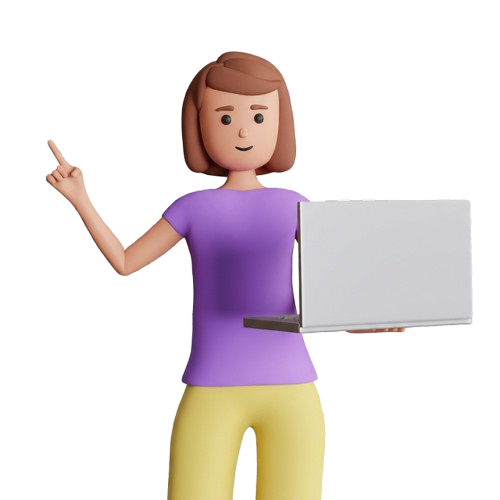
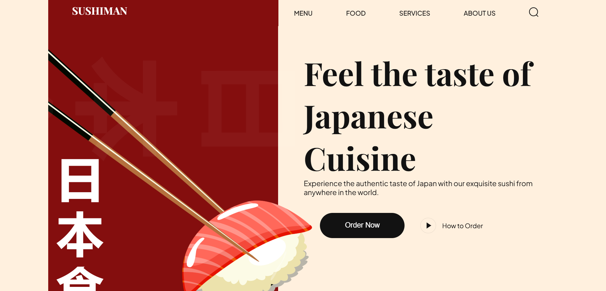

# 🌟 Portfolio Website - Niharika Mente

Welcome to my professional portfolio! This project showcases my journey as a **Software Engineer** and **Open Source Contributor**, featuring my skills, projects, and experiences in the tech world.

<p align="center">
  
</p>

---

## 🚀 Overview

This website is a modern, high-performance portfolio built using the **Next.js** framework. It features a sleek dark-themed design, smooth animations, and a responsive layout to ensure an optimal viewing experience across all devices.

## 🛠️ Tech Stack


## ✨ Key Features

-   **Responsive Design**: Optimized for mobile, tablet, and desktop views.
-   **Smooth Animations**: Leverages **Framer Motion** and **React Tilt** for a dynamic user experience.
-   **Modern UI**: Crafted with **Tailwind CSS** for a clean and professional aesthetic.
-   **Typewriter Effect**: Interactive landing page with dynamic text.
-   **Project Showcase**: Categorized display of Web, Mobile, and UI/UX projects.
-   **SEO Optimized**: Built with Next.js for better search engine visibility.

## 📸 Screenshots

| Landing Page | Projects View |
| :---: | :---: |
|  |  |

*(Note: Replace with actual screenshots for best effect)*

## 🛠️ Installation & Setup

To run this project locally, follow these steps:

1. **Clone the repository:**
   ```bash
   git clone https://github.com/niharika-mente/portfolio-2.git
   ```
2. **Navigate to the project directory:**
   ```bash
   cd portfolio-2
   ```
3. **Install dependencies:**
   ```bash
   npm install
   ```
4. **Run the development server:**
   ```bash
   npm run dev
   ```
5. **Open in browser:**
   Navigate to [http://localhost:3000](http://localhost:3000)

## 🤝 Connect with Me

I'm always open to discussing new projects, creative ideas, or opportunities to be part of your visions.

- **GitHub**: [niharika-mente](https://github.com/niharika-mente)
- **LinkedIn**: [Niharika Mente](https://www.linkedin.com/in/niharika-mente-473434323)
- **Instagram**: [___niharika___18](https://www.instagram.com/___niharika___18/)
- **Email**: [menteniharika@gmail.com](mailto:menteniharika@gmail.com)

---

<p align="center">Made with ❤️ by Niharika Mente💫</p>
